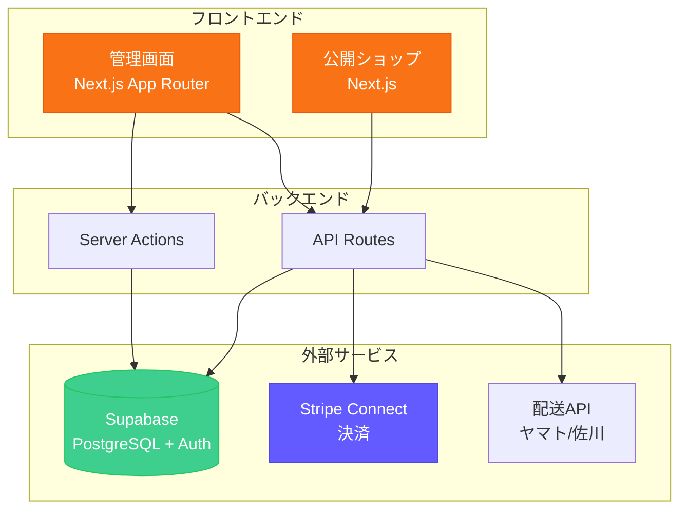
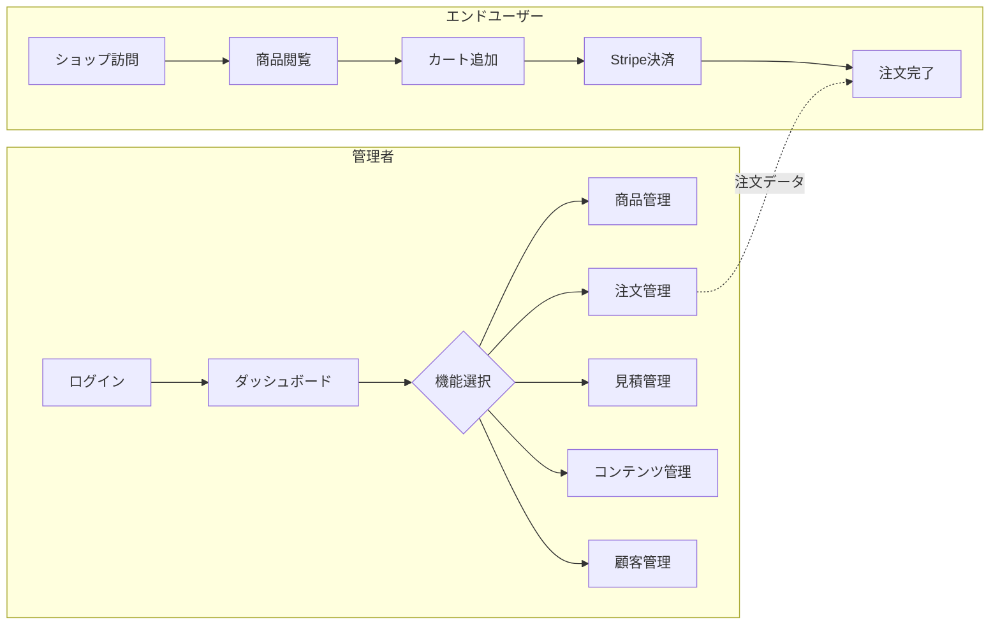
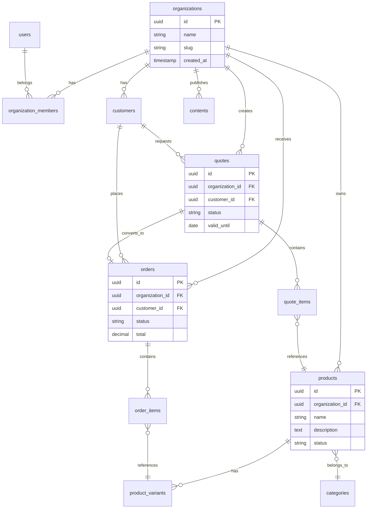
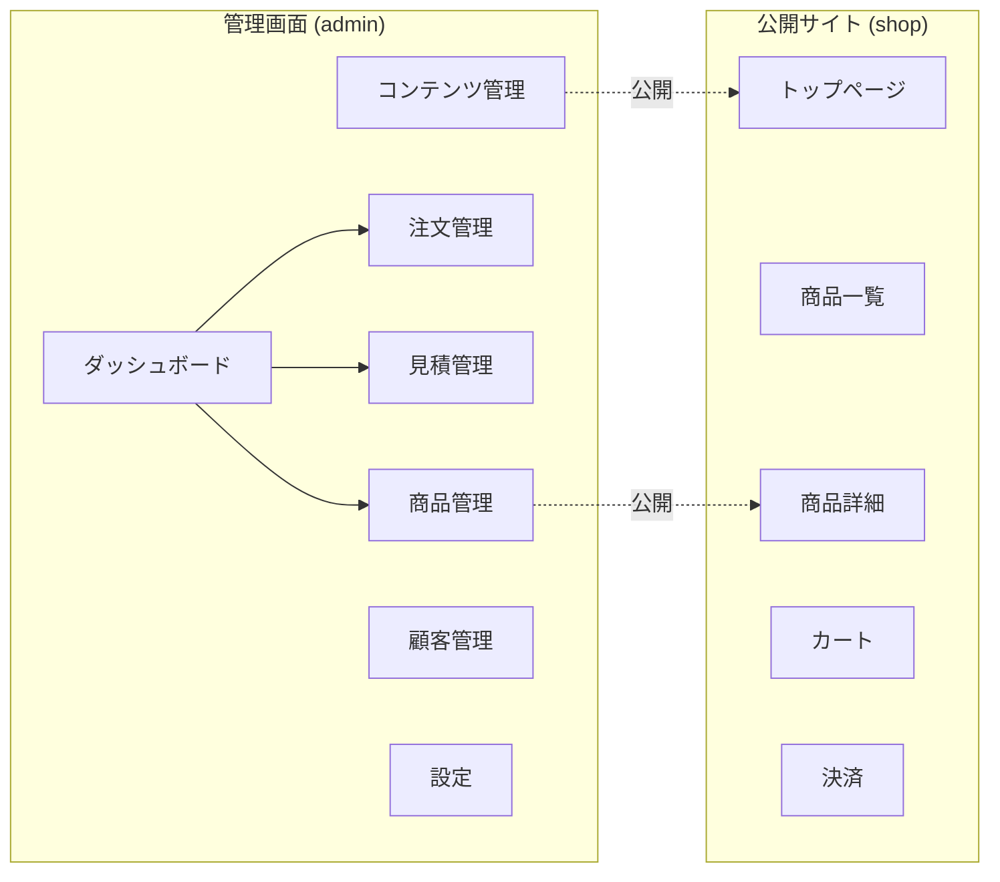
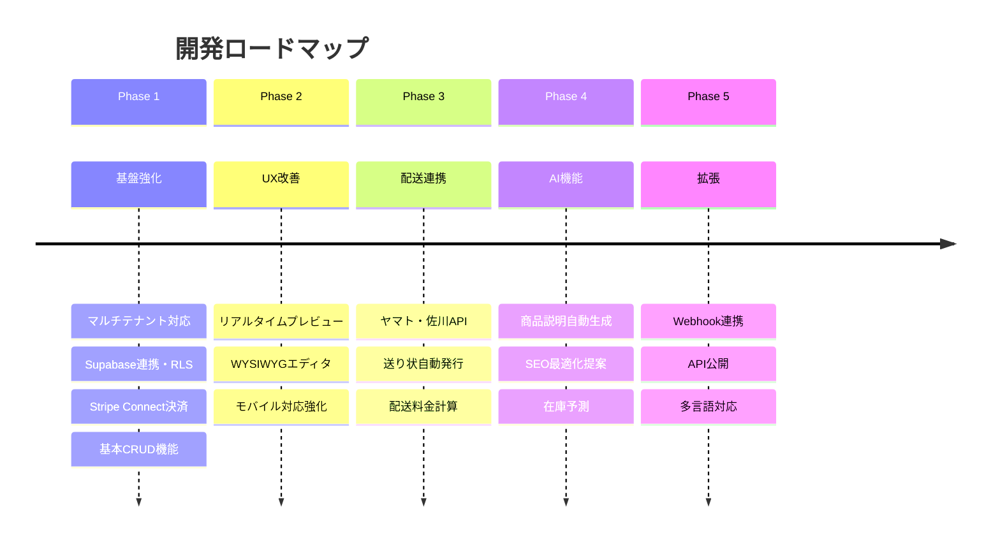

<p align="center">
  
</p>

<h1 align="center">商い（アキナイ）</h1>

<p align="center">
  <strong>B2B向けマルチテナント型 EC・CMS SaaS プラットフォーム</strong>
</p>

<p align="center">
  
  
  
  
  
</p>

---

## プロジェクトの目的

「商い（アキナイ）」は、**中小企業や店舗が自社ECとコンテンツ発信を一つのプラットフォームで完結できる**ことを目指したSaaSサービスです。

### 解決したい課題

1. **複数ツールの分断** - EC、CMS、顧客管理がバラバラで運用が煩雑
2. **B2B対応の難しさ** - 見積機能や法人顧客管理ができるサービスが少ない
3. **使いにくいUI** - 既存サービスは機能過多で、ITに不慣れな担当者には難しい
4. **初期・運用コストの高さ** - 小規模事業者には導入障壁が高い

### ビジョン

> 「おじさんでも見やすく使いやすい」
> 商品登録から記事作成、見積発行、決済まで、**誰でも迷わず使えるシンプルな管理画面**を提供する。

---

## サービス概要

### ターゲットユーザー

- 自社ECを始めたい中小企業・個人事業主
- B2B取引（見積ベース）を行う卸売業・メーカー
- 商品紹介と情報発信を一体で行いたい店舗

### 主要機能

| 機能 | 説明 |
|------|------|
| **商品管理** | 商品登録、バリエーション（サイズ・色など）、在庫管理、カテゴリー・タグ |
| **コンテンツ管理** | ニュース、特集記事、お知らせの作成・公開予約 |
| **注文管理** | 注文一覧、ステータス管理、配送追跡 |
| **見積管理（B2B）** | 見積作成・送付、交渉ステータス管理、注文への変換 |
| **顧客管理** | 個人・法人顧客、購入履歴、タグ付け |
| **ダッシュボード** | 売上推移、注文数、在庫アラート、人気商品 |
| **マルチテナント** | 組織ごとのデータ分離、メンバー招待、ロール管理 |
| **決済連携** | Stripe Connect による各テナント独自の決済 |
| **ショップフロント** | 組織ごとにカスタマイズ可能な公開用ECサイト |

### システム構成図



### ユーザーフロー



---

## スクリーンショット

> **📸 Coming Soon**
> 開発中のため、スクリーンショットは後日追加予定です。

<!--
スクリーンショットを追加する場合:
1. docs/screenshots/ フォルダを作成
2. 以下の画像を配置:
   - dashboard.png (ダッシュボード)
   - products.png (商品管理)
   - orders.png (注文管理)
   - contents.png (コンテンツ管理)


-->

| 画面 | 説明 |
|------|------|
| ダッシュボード | 売上推移・注文数・在庫アラートを一目で確認 |
| 商品管理 | 商品登録・バリエーション・在庫をまとめて管理 |
| 注文管理 | 注文一覧・ステータス変更・配送手配 |
| 見積管理 | B2B向け見積作成・交渉・注文変換 |
| コンテンツ管理 | 記事・ニュース・特集の作成と公開 |

---

## 技術スタック

| カテゴリ | 技術 |
|----------|------|
| **フレームワーク** | Next.js 16 (App Router) |
| **言語** | TypeScript |
| **スタイリング** | Tailwind CSS v4 |
| **UIコンポーネント** | shadcn/ui + Radix UI |
| **データベース** | Supabase (PostgreSQL) |
| **認証** | Supabase Auth |
| **決済** | Stripe / Stripe Connect |
| **ホスティング** | Netlify |
| **チャート** | Recharts |
| **フォーム** | React Hook Form + Zod |
| **ドラッグ&ドロップ** | dnd-kit |

---

## データベース設計

### ER図（主要テーブル）



### 主要テーブル一覧

| テーブル | 説明 |
|----------|------|
| `organizations` | 組織（テナント） |
| `organization_members` | メンバー管理 |
| `users` | ユーザー |
| `products` | 商品 |
| `product_variants` | バリエーション（SKU単位） |
| `categories` | 商品カテゴリ |
| `customers` | 顧客（個人・法人） |
| `orders` | 注文 |
| `order_items` | 注文明細 |
| `quotes` | 見積 |
| `quote_items` | 見積明細 |
| `contents` | コンテンツ（記事・ニュース・特集） |
| `stock_movements` | 在庫移動履歴 |

### マルチテナント設計

- 全データテーブルに `organization_id` を持たせ、組織単位でデータを分離
- Row Level Security (RLS) でアクセス制御
- ロール: `owner` / `admin` / `manager` / `editor` / `viewer`

---

## プロジェクト構造

```
📁 src/
├── 📁 app/
│   ├── 📁 (admin)/              # 🔐 管理画面
│   │   ├── 📁 dashboard/        #    ダッシュボード
│   │   ├── 📁 products/         #    商品管理
│   │   ├── 📁 contents/         #    コンテンツ管理
│   │   ├── 📁 orders/           #    注文管理
│   │   ├── 📁 quotes/           #    見積管理
│   │   ├── 📁 customers/        #    顧客管理
│   │   ├── 📁 agents/           #    AIエージェント設定
│   │   └── 📁 settings/         #    設定
│   ├── 📁 (auth)/               # 🔑 認証画面
│   ├── 📁 shop/                 # 🛒 公開ショップフロント
│   └── 📁 api/                  # 🔌 APIエンドポイント
├── 📁 components/
│   ├── 📁 layout/               #    ヘッダー、サイドバー等
│   ├── 📁 providers/            #    Context プロバイダー
│   └── 📁 ui/                   #    shadcn/ui コンポーネント
├── 📁 lib/
│   ├── 📁 actions/              #    Server Actions
│   ├── 📁 supabase/             #    Supabase クライアント
│   └── 📁 webhooks/             #    Webhook 処理
└── 📁 types/                    #    TypeScript 型定義
```

### 画面構成図



---

## セットアップ

### 必要条件

- Node.js 20.x 以上（`.nvmrc` 参照）
- Supabase プロジェクト
- Stripe アカウント（決済機能を使う場合）

### インストール

```bash
# リポジトリをクローン
git clone https://github.com/your-org/akinai.git
cd akinai

# 依存関係をインストール
npm install

# 環境変数を設定
cp .env.example .env.local
# .env.local に Supabase, Stripe の認証情報を記入

# 開発サーバーを起動
npm run dev
```

ブラウザで http://localhost:3000 を開いてください。

### Supabase マイグレーション

```bash
# Supabase CLI でマイグレーションを適用
supabase db push
```

### Google ログインの有効化（任意）

ログイン画面の「Googleでログイン」を有効にするには、以下を実施してください。

1. **Google Cloud Console**
   - [Google Cloud Console](https://console.cloud.google.com/) でプロジェクトを作成または選択
   - **APIとサービス** → **認証情報** → **認証情報を作成** → **OAuth 2.0 クライアント ID**
   - アプリケーションの種類: **ウェブアプリケーション**
   - **承認済みのリダイレクト URI** に以下を追加:
     - `https://<プロジェクト参照ID>.supabase.co/auth/v1/callback`
     - （Supabase Dashboard → **Project Settings** → **API** の **Project URL** のホスト部分が参照IDです）
   - クライアント ID とクライアント シークレットをコピー

2. **Supabase Dashboard**
   - **Authentication** → **Providers** → **Google** を有効化
   - Client ID と Client Secret を貼り付け、保存
   - **URL Configuration** の **Redirect URLs** に次の **2件** を追加（ローカルと本番の両方でログインできるようにする）:
     - `http://localhost:3000/auth/callback`
     - `https://akinai.netlify.app/auth/callback`

3. ログインページで「Googleでログイン」をクリックし、Google認証後に `/auth/callback` 経由でダッシュボードへリダイレクトされることを確認してください。  
   新規でGoogleログインしたユーザーは、いずれかの組織の管理者から **設定 → メンバー** で招待される必要があります。

**Googleログインで「This page isn't working」や invalid response が出る場合**

- **Google Cloud Console** の「承認済みのリダイレクト URI」には **アプリのURLではなく Supabase のURL** を 1 件だけ登録します。  
  `https://<あなたのプロジェクト参照ID>.supabase.co/auth/v1/callback`  
  （例: `https://mvedkgtujsuctaemfnij.supabase.co/auth/v1/callback`）  
  `http://localhost:3000/...` や `https://akinai.netlify.app/...` は **登録しない**でください。
- **Supabase** の **Authentication → Providers → Google** で、Google を有効にし、Client ID と Client Secret を正しく貼り付けて保存しているか確認してください。
- 認証後にログイン画面に戻りエラーが出る場合は、画面に表示されるメッセージ（`detail`）を確認してください。

### ローカルと本番（Netlify）の両方で動かす

- **認証のリダイレクト**  
  アプリは `window.location.origin` を使うため、ローカルでは `http://localhost:3000/auth/callback`、本番では `https://akinai.netlify.app/auth/callback` に自動で戻ります。  
  Supabase の **Authentication → URL Configuration → Redirect URLs** に上記 2 件を登録しておけば、どちらの環境でもログイン・Googleログインが動作します。

- **Netlify の環境変数**  
  本番で Supabase と連携するため、Netlify の **Site settings → Environment variables** で以下を設定してください。
  - `NEXT_PUBLIC_SUPABASE_URL` … Supabase の Project URL
  - `NEXT_PUBLIC_SUPABASE_ANON_KEY` … Supabase の anon key  
  Stripe 連携を使う場合は `NEXT_PUBLIC_APP_URL` に `https://akinai.netlify.app` を設定してください。

---

## 開発コマンド

```bash
npm run dev      # 開発サーバー起動
npm run build    # 本番ビルド
npm run start    # 本番サーバー起動
npm run lint     # ESLint 実行
```

---

## 今後のロードマップ



### Phase 1: 基盤強化 ✅ 現在

| 機能 | 状態 |
|------|------|
| マルチテナント対応（組織・メンバー管理） | ✅ 完了 |
| Supabase 連携・RLS 設定 | ✅ 完了 |
| Stripe Connect 決済連携 | ✅ 完了 |
| 基本的な商品・注文・コンテンツ管理 | ✅ 完了 |
| ダッシュボードウィジェットのカスタマイズ機能 | 🚧 開発中 |

### Phase 2: UX改善

| 機能 | 説明 |
|------|------|
| リアルタイムプレビュー | 商品・コンテンツ編集時にプレビューを見ながら入力 |
| Googleドキュメント風エディタ | 記事作成を直感的に（WYSIWYG強化） |
| モバイル対応強化 | スマホでも快適に管理できるUI |
| ガイド・チュートリアル | 初回ログイン時のオンボーディング |

### Phase 3: 配送・物流連携

| 機能 | 説明 |
|------|------|
| 配送業者API連携 | ヤマト運輸、佐川急便など |
| 送り状自動発行 | 注文データから自動生成 |
| 配送料金自動計算 | 重量・サイズ・配送先から算出 |

### Phase 4: AI機能

| 機能 | 説明 |
|------|------|
| 商品説明文の自動生成 | 画像・キーワードからAIが生成 |
| SEO最適化提案 | タイトル・メタ情報の改善提案 |
| 在庫予測・発注提案 | 販売データから需要予測 |
| チャットボット対応 | 顧客対応の自動化 |

### Phase 5: 拡張・エコシステム

| 機能 | 説明 |
|------|------|
| Webhook連携 | 外部システムへのイベント通知 |
| APIドキュメント公開 | 外部開発者向けAPI |
| テンプレートマーケットプレイス | テーマ・テンプレートの共有 |
| 多言語対応 | 英語・中国語など |

---

## 差別化ポイント

```
┌─────────────────────────────────────────────────────────────────┐
│                        商い（アキナイ）                          │
├─────────────────────────────────────────────────────────────────┤
│                                                                 │
│  🔄 B2B + B2C 両対応        │  🏢 マルチテナントSaaS           │
│  見積機能と通常EC機能を統合  │  1つのプラットフォームで         │
│                             │  複数店舗を運営可能              │
│─────────────────────────────┼─────────────────────────────────│
│  👴 シンプルで使いやすいUI   │  💳 Stripe Connect             │
│  機能を絞り込み、            │  各テナントが独自に             │
│  直感的な操作性を重視        │  決済を受け取れる               │
│─────────────────────────────┴─────────────────────────────────│
│                    🇯🇵 国産・日本語ネイティブ                   │
│            日本の商習慣（見積文化、消費税対応）に最適化          │
└─────────────────────────────────────────────────────────────────┘
```

| ポイント | 説明 | 競合との違い |
|----------|------|--------------|
| **B2B + B2C 両対応** | 見積機能と通常EC機能を統合 | 多くのサービスはどちらか一方 |
| **マルチテナントSaaS** | 1つのプラットフォームで複数店舗を運営可能 | 店舗ごとの契約が不要 |
| **シンプルで使いやすいUI** | 機能を絞り込み、直感的な操作性を重視 | ITに不慣れな担当者でも使える |
| **Stripe Connect** | 各テナントが独自に決済を受け取れる | プラットフォーム経由ではない直接決済 |
| **国産・日本語ネイティブ** | 日本の商習慣（見積文化、消費税対応）に最適化 | 海外サービスの翻訳版ではない |

---

## デザインガイドライン

### カラーパレット

```
┌──────────────────────────────────────────────────────────────┐
│  プライマリ（オレンジ系グラデーション）                        │
│  ████████████████  #f97316 → #ea580c                        │
├──────────────────────────────────────────────────────────────┤
│  サイドバー（ダークテーマ）                                   │
│  ████████████████  #1f2937 (Gray-800)                       │
├──────────────────────────────────────────────────────────────┤
│  背景（ライトモード）         背景（ダークモード）             │
│  ░░░░░░░░  #f9fafb           ████████  #111827              │
└──────────────────────────────────────────────────────────────┘
```

### UIポリシー

| ポリシー | 説明 |
|----------|------|
| 📊 **情報過多を避ける** | 1画面に表示する情報は必要最小限に |
| 🎯 **アクションは明確に** | 主要ボタンは目立たせ、迷わせない |
| 📐 **余白を活かす** | 詰め込まず、視認性を確保 |

> **コンセプト**: 「おじさんでも見やすく使いやすい」

---

## クイックスタート

```bash
# 1. クローン
git clone https://github.com/your-org/akinai.git && cd akinai

# 2. 依存関係インストール
npm install

# 3. 環境変数設定
cp .env.example .env.local

# 4. 開発サーバー起動
npm run dev
```

ブラウザで http://localhost:3000 を開いてください。

---

## ライセンス

Private - All rights reserved.

---

<p align="center">
  
  <br>
  <strong>商い（アキナイ）</strong>
  <br>
  <em>仕事で安心して使えるEC・CMSプラットフォーム</em>
</p>
